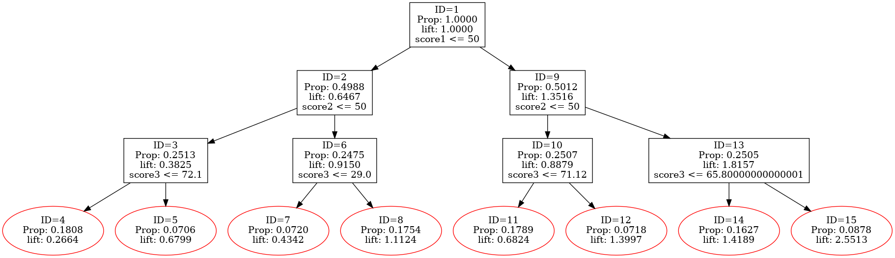
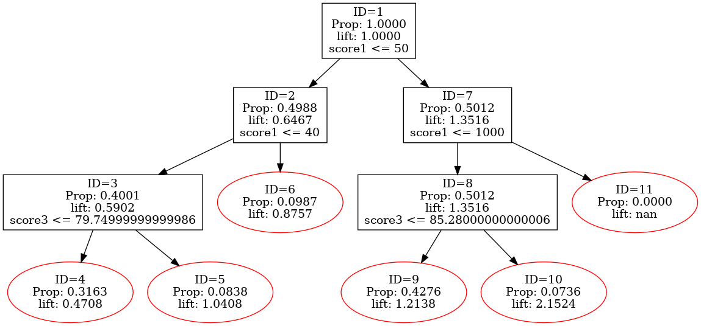

## **一、概述**

### __Auto_Risk_Rule_Search__ 
#### 是一个专为信贷风控策略组合的定制化决策树类，用于构建和优化风险规则模型。
#### 通过提供多种控制树构建过程的方法，如设置最大深度、优先使用的特征、固定阈值、动态搜索步长等，可以根据业务需求定制特征分裂策略，支持灵活的逻辑表达和指标计算。
#### 该工具旨在帮助风控策略人员快速构建符合业务逻辑的决策树模型，提高逾期率预测的准确性，优化风险控制效果。

#### __这里将提供部分示例，帮助大家快速上手__

### **我们生成一组数据来模拟信贷数据场景**
#### 我们模拟信贷场景，连续型变量类似收入、信用分、多头等，label对应不同不同账期的ever口径风险标签（当然只要是类似的数据场景实际上都可以用这个工具搜索）


```python
import numpy as np
import pandas as pd
from sklearn.metrics import roc_auc_score
from sklearn.preprocessing import MinMaxScaler

# 设置随机种子以保证结果可重复
np.random.seed(42)

# 生成ID
n = 50000
df = pd.DataFrame({
    'id': np.arange(1, n + 1)
})

# 生成score1~score7
# score1~3：评分越高对应逾期率越高
df['score1'] = np.random.randint(1, 101, size=n)
df['score2'] = np.random.randint(1, 101, size=n)
df['score3'] = np.random.randint(1, 101, size=n)

# score4~7：评分越高对应越低越低
df['score4'] = np.random.randint(1, 101, size=n)
df['score5'] = np.random.randint(1, 101, size=n)
df['score6'] = np.random.randint(1, 101, size=n)
df['score7'] = np.random.randint(1, 101, size=n)

# 反转score4~7，使得越低越好对应评分越高
df['score4_rev'] = 101 - df['score4']
df['score5_rev'] = 101 - df['score5']
df['score6_rev'] = 101 - df['score6']
df['score7_rev'] = 101 - df['score7']

# 标准化评分以减少相关性
scaler = MinMaxScaler()
score_cols = ['score1', 'score2', 'score3', 'score4_rev', 'score5_rev', 'score6_rev', 'score7_rev']
df_scaled = pd.DataFrame(scaler.fit_transform(df[score_cols]), columns=score_cols)

# 构建标签生成的基础分数
# 权重可以根据需要调整，以控制AUC
# 这里简单地给每个评分一个权重
weights_label3 = np.array([0.1, 0.1, 0.1, 0.1, 0.1, 0.1, 0.1])
weights_label2 = np.array([0.15, 0.15, 0.15, 0.1, 0.1, 0.1, 0.1])
weights_label1 = np.array([0.2, 0.2, 0.2, 0.15, 0.15, 0.1, 0.1])

# 计算分数
df['score_label3'] = df_scaled.values @ weights_label3
df['score_label2'] = df_scaled.values @ weights_label2
df['score_label1'] = df_scaled.values @ weights_label1

# 添加随机噪声
df['score_label3'] += np.random.normal(0, 0.1, size=n)
df['score_label2'] += np.random.normal(0, 0.1, size=n)
df['score_label1'] += np.random.normal(0, 0.1, size=n)

# 计算概率（使用sigmoid函数）
def sigmoid(x):
    return 1 / (1 + np.exp(-x))

df['prob_label3'] = sigmoid(df['score_label3'])
df['prob_label2'] = sigmoid(df['score_label2'])
df['prob_label1'] = sigmoid(df['score_label1'])

# 调整阈值以达到目标比例
# 先排序概率
df = df.sort_values('prob_label3', ascending=False)
threshold_label3 = df['prob_label3'].quantile(1 - 0.15)
df['label3'] = (df['prob_label3'] >= threshold_label3).astype(int)

df = df.sort_values('prob_label2', ascending=False)
threshold_label2 = df['prob_label2'].quantile(1 - 0.08)
df['label2'] = (df['prob_label2'] >= threshold_label2).astype(int)

df = df.sort_values('prob_label1', ascending=False)
threshold_label1 = df['prob_label1'].quantile(1 - 0.03)
df['label1'] = (df['prob_label1'] >= threshold_label1).astype(int)

# 应用标签的层级逻辑
# 如果label1为1，则label2和label3必须为1
df.loc[df['label1'] == 1, 'label2'] = 1
df.loc[df['label1'] == 1, 'label3'] = 1

# 如果label2为1，则label3必须为1
df.loc[df['label2'] == 1, 'label3'] = 1

# 重新计算实际比例
actual_label1 = df['label1'].mean() * 100
actual_label2 = df['label2'].mean() * 100
actual_label3 = df['label3'].mean() * 100

print(f"实际label1比例: {actual_label1:.2f}%")
print(f"实际label2比例: {actual_label2:.2f}%")
print(f"实际label3比例: {actual_label3:.2f}%")

# 选择最终的标签
labels = ['label1', 'label2', 'label3']

# 计算每个评分与每个标签的AUC
from sklearn.metrics import roc_auc_score

score_features = ['score1', 'score2', 'score3', 'score4', 'score5', 'score6', 'score7']

auc_results = {}

for label in labels:
    auc_results[label] = {}
    for score in score_features:
        auc = roc_auc_score(df[label], df[score])
        auc_results[label][score] = auc

# 将AUC结果整理为DataFrame
auc_df = pd.DataFrame(auc_results).T

print("\n每个评分与每个标签的AUC:")
print(auc_df)
```

    实际label1比例: 3.00%
    实际label2比例: 9.71%
    实际label3比例: 20.84%
    
    每个评分与每个标签的AUC:
              score1    score2    score3    score4    score5    score6    score7
    label1  0.733003  0.745065  0.738253  0.315138  0.320699  0.371807  0.366489
    label2  0.693565  0.698823  0.688540  0.364667  0.366829  0.373671  0.376984
    label3  0.647794  0.654021  0.649669  0.372550  0.370505  0.375288  0.373020
    


```python
# 给定一个数据集
import pandas as pd
from auto_risk_rule_search import Auto_Risk_Rule_Search
sample_data = df.copy()
```

## **二、数据集构建调用**

### 该数据表包含多个特征以及标签，接下来我们将构建支持Auto_Risk_Rule_Search的数据格式
#### **数据集要求X，y。X为特征，y为目标标签（注：X只支持数值型，且不为空，可填充-99999）**


```python
features = ['score1','score2','score3','score4','score5','score6','score7']

X = sample_data[features]
y = sample_data['label3']
X = X.replace(-999, -99999999)
X = X.fillna(-99999999)
```

## **三、超参数设置及策略搜索**

### **Auto_Risk_Rule_Search超参数如下所示：**
#### **max_depth**：树的最大深度。
#### **priority_features**：特征优先级列表，指定每一层使用的特征。
#### **fixed_thresholds**：固定阈值列表，指定每一层的分割阈值。
#### **dynamic_min_sample_ratios**：动态最小样本比例列表，指定每一层的最小样本比例。
#### **search_steps**：搜索步长列表，控制动态步长搜索的精细程度。
#### **random_state**：随机种子，确保结果可重复。
#### **min_samples_leaf**：叶节点的最小样本比例，防止过拟合。
#### **verbose**：是否输出详细信息。
#### **print_tree_structure**：是否打印树的结构。
#### **print_tree**：是否打印树的文本表示。
#### **visualize_tree**：是否可视化树结构。
#### **print_log**：是否打印日志信息。
#### **top_n_splits**：在每轮搜索中保留的最佳分割点数量。
#### **smooth_factor**：平滑因子，用于调整搜索过程中的步长。
#### **feature_directions**：特征方向，用于指定特征的优化方向（升序、降序、随机）。
#### **optimization_target**：优化目标，可选 'lift_diff'、'min_lift'、'max_lift'。
#### **search_mode**：搜索模式，'equal_width'（等宽）或 'equal_freq'（等频）。


```python
model = Auto_Risk_Rule_Search(
    # 树深度、组合策略一般设置到3~4比较合理，太深容易过拟合
    max_depth=3, 
    # 这个参数代表树将按照指定的变量顺序完成分裂，一般建议按照场景进行顺序预设
    # 如果不设置这个参数，每个分裂节点将对所有所有特征进行遍历搜索，耗时巨大，且最终结果解释性不强
    # 如果认为单个特征二分裂可解释性不强，单个特征可多次出现，从而增强单特征表达如['score1','score1']
    priority_features=['score1','score2','score3','score4','score5','score6','score7'],
    # 该特征可声明每个分裂节点的优化目标，None就是两个子树lift差最大，'min_lift'，'max_lift'代表两个子树lift最大（最小）为目标，即max(left,right)最大或者min(left,right)最小
    # optimization_target支持设置全局优化目标，以及针对决策树某一层或者某一个节点定制优化目标
    # 如下，optimization_target内部长度为1、2、4、8对应着二叉树每个节点
    optimization_target=[None, ['min_lift', 'max_lift'], [None,'min_lift','max_lift',None], [None,None,None,None,None,'min_lift','max_lift',None]],
    # 用于声明方向，如评分等有严格的排序要求，提前声明顺序可以防止搜索出倒挂导致的局部极值，将会限制左右子树有严格的解释性
    # 如未声明，将不会做严格的搜索限制
    feature_directions=[('score1','asc'),('score2','asc'),('score3','asc'),
                        ('score4','desc'),('score5','desc'),('score6','desc'),('score7','desc')],
    # fixed_thresholds 用于定义某个分裂节点是否按照设定好的阈值做分裂，使用场景如在已有的策略上做策略叠加时，可以把现有的策略设定好，然后做进一步搜索
    # fixed_thresholds 同样支持针对层设定阈值，或精确到某个分裂点的阈值，如不设置该参数，将会开启搜索
    fixed_thresholds=[50,[50,50],None], 
    # dynamic_min_sample_ratio该变量用于控制某一个分裂节点分裂后左右子树包含的最小样本数
    # 如想控制拒绝、捞回样本比例时，可以设置此超参数
    dynamic_min_sample_ratios=[0.35,0.15,0.07], 
    # 与dynamic_min_sample_ratio类似，只不过是限制叶子节点最小样本比例
    min_samples_leaf=0.02,
    # 邻域搜索步长，[0.1,0.1,0.1]的逻辑是先在全局按照十等分搜索，然后得到备选最优值，再在备选值附近十等分做更小步长搜索，持续三轮
    search_steps=[0.1,0.1,0.1],
    # top_n_splits表示每一轮会选择多少备选最优点做进一步的邻域搜索（默认3）
    top_n_splits=[3,4,5],  
    # 设置等分的时候按照等频还是等距，默认等距
#    search_mode='equal_freq'
    # 限制每一轮做邻域搜索时，得分涨的太快导致搜索到了局部极值
#    smooth_factor=0.95, 
    
    
    # 开始之前输出逾期率、样本数，默认True
#    verbose = False,
    # 生成字典结构的树，默认False
#    print_tree_structure=True,
    # 生成文本结构的树，默认False
#    print_tree=True,
    # 生成树可视化图片，默认False
    visualize_tree=True,
    # 打印搜索日志，默认False
#    print_log=True,
    
    # random_state不重要
    random_state=27,
)
model.fit(X, y)
```

    整体样本数: 50000
    全局逾期率（坏人比例）: 0.2084
    计算得到的权重（坏人样本）: 4.80
    


    

    


## **日常使用时，不需要设置上述太多参数，以下提供一个示例：**


```python
# 基本上只需要以下几个参数，就能满足90%以上的需求
model = Auto_Risk_Rule_Search(
    max_depth=3, 
    priority_features=['score1','score1','score3','score4','score5','score6','score7'],
    optimization_target=[None, ['min_lift', 'max_lift'], [None,'min_lift','max_lift',None], [None,None,None,None,None,'min_lift','max_lift',None]],
    feature_directions=[('score1','asc'),('score2','asc'),('score3','asc'),
                        ('score4','desc'),('score5','desc'),('score6','desc'),('score7','desc')], 
    fixed_thresholds=[50,[40,1000],None], 
    dynamic_min_sample_ratios=[0.35,0.15,0.07], 
    min_samples_leaf=0.02,
    search_steps=[0.01],
    visualize_tree=True,
)
model.fit(X, y)
```

    整体样本数: 50000
    全局逾期率（坏人比例）: 0.2084
    计算得到的权重（坏人样本）: 4.80
    


    

    


## **树结构解读**
### 第一层的''score1''可以理解为线上免费前筛目前为50，假如现在想降低前筛阈值，则可以在第二层设置40、1000，代表预期降低的阈值
### 节点14、16都可以理解为捞回区域
### 节点20、19都可以理解为二次拒绝区域
### 每个节点都可以针对'min_lift', 'max_lift','lift_diff'来定制化搜索，可以针对业务背景自行调整。

## **四、便利化函数**

### **get_filter_logic**  可以输出单个或者多个节点的逻辑、代码，以辅助快速进行数据筛选等工作
### **需要注意，KS以及AUC的计算逻辑是：ks = max(abs(tpr - fpr)）、0.5 + abs(0.5 - roc_auc_score(y, X))**


```python
model.get_filter_logic(
       # node_ids用于选定分裂点（有ID对应的点，都可以选）
       node_ids=[4,9],
       # 是否输出直接可运行的筛选代码
       output_type='code',
       # 提供dataframe名
       df_name='my_df', 
       # 是否计算选定ID筛选逻辑下的ks、auc，是用的X、y是什么，这里的X、y可以是oot或者验证集的数据
       calculate_metrics=True, X=X, y=y,
       # 如果y中包含多个标签，这里需要定义一下
       label_columns = ['label1','label2'])
```

    ID 4解析前的逻辑表达式: (score1 <= 50 & score1 <= 40 & score3 <= 79.74999999999986)
    ID 9解析前的逻辑表达式: (score1 > 50 & score1 <= 1000 & score3 <= 85.28000000000006)
    ID [4, 9]解析前的逻辑表达式: (score1 <= 50 & score1 <= 40 & score3 <= 79.74999999999986) | (score1 > 50 & score1 <= 1000 & score3 <= 85.28000000000006)
    样本数量: 37194
    


    ("my_df[((my_df['score1'] <= 50)  &  (my_df['score1'] <= 40)  &  (my_df['score3'] <= 79.74999999999986))  |  ((my_df['score1'] > 50)  &  (my_df['score1'] <= 1000)  &  (my_df['score3'] <= 85.28000000000006))]",
     {'score1': {'KS': 0.254, 'AUC': 0.662},
      'score3': {'KS': 0.199, 'AUC': 0.636}})


```python
# 可以直接复制粘贴过来调用
my_df = sample_data.copy()
my_df[((my_df['score1'] <= 50)  &  (my_df['score1'] <= 40)  &  (my_df['score3'] <= 79.74999999999986))  |  ((my_df['score1'] > 50)  &  (my_df['score1'] <= 1000)  &  (my_df['score3'] <= 85.28000000000006))]
```


<div>
<style scoped>
    .dataframe tbody tr th:only-of-type {
        vertical-align: middle;
    }

    .dataframe tbody tr th {
        vertical-align: top;
    }

    .dataframe thead th {
        text-align: right;
    }
</style>
<table border="1" class="dataframe">
  <thead>
    <tr style="text-align: right;">
      <th></th>
      <th>id</th>
      <th>score1</th>
      <th>score2</th>
      <th>score3</th>
      <th>score4</th>
      <th>score5</th>
      <th>score6</th>
      <th>score7</th>
      <th>score4_rev</th>
      <th>score5_rev</th>
      <th>...</th>
      <th>score7_rev</th>
      <th>score_label3</th>
      <th>score_label2</th>
      <th>score_label1</th>
      <th>prob_label3</th>
      <th>prob_label2</th>
      <th>prob_label1</th>
      <th>label3</th>
      <th>label2</th>
      <th>label1</th>
    </tr>
  </thead>
  <tbody>
    <tr>
      <th>27618</th>
      <td>27619</td>
      <td>97</td>
      <td>47</td>
      <td>65</td>
      <td>30</td>
      <td>28</td>
      <td>54</td>
      <td>4</td>
      <td>71</td>
      <td>73</td>
      <td>...</td>
      <td>97</td>
      <td>0.500657</td>
      <td>0.678692</td>
      <td>1.165373</td>
      <td>0.622614</td>
      <td>0.663447</td>
      <td>0.762308</td>
      <td>1</td>
      <td>1</td>
      <td>1</td>
    </tr>
    <tr>
      <th>36937</th>
      <td>36938</td>
      <td>94</td>
      <td>91</td>
      <td>83</td>
      <td>20</td>
      <td>29</td>
      <td>3</td>
      <td>55</td>
      <td>81</td>
      <td>72</td>
      <td>...</td>
      <td>46</td>
      <td>0.592698</td>
      <td>0.636522</td>
      <td>1.133723</td>
      <td>0.643984</td>
      <td>0.653967</td>
      <td>0.756525</td>
      <td>1</td>
      <td>1</td>
      <td>1</td>
    </tr>
    <tr>
      <th>1790</th>
      <td>1791</td>
      <td>89</td>
      <td>58</td>
      <td>75</td>
      <td>20</td>
      <td>5</td>
      <td>60</td>
      <td>46</td>
      <td>81</td>
      <td>96</td>
      <td>...</td>
      <td>55</td>
      <td>0.511554</td>
      <td>0.648751</td>
      <td>1.105736</td>
      <td>0.625171</td>
      <td>0.656729</td>
      <td>0.751333</td>
      <td>1</td>
      <td>1</td>
      <td>1</td>
    </tr>
    <tr>
      <th>47327</th>
      <td>47328</td>
      <td>96</td>
      <td>93</td>
      <td>72</td>
      <td>97</td>
      <td>35</td>
      <td>60</td>
      <td>82</td>
      <td>4</td>
      <td>66</td>
      <td>...</td>
      <td>19</td>
      <td>0.375931</td>
      <td>0.395593</td>
      <td>1.105248</td>
      <td>0.592891</td>
      <td>0.597628</td>
      <td>0.751242</td>
      <td>1</td>
      <td>1</td>
      <td>1</td>
    </tr>
    <tr>
      <th>5256</th>
      <td>5257</td>
      <td>61</td>
      <td>97</td>
      <td>83</td>
      <td>40</td>
      <td>11</td>
      <td>52</td>
      <td>58</td>
      <td>61</td>
      <td>90</td>
      <td>...</td>
      <td>43</td>
      <td>0.482578</td>
      <td>0.632009</td>
      <td>1.086029</td>
      <td>0.618357</td>
      <td>0.652945</td>
      <td>0.747633</td>
      <td>1</td>
      <td>1</td>
      <td>1</td>
    </tr>
    <tr>
      <th>...</th>
      <td>...</td>
      <td>...</td>
      <td>...</td>
      <td>...</td>
      <td>...</td>
      <td>...</td>
      <td>...</td>
      <td>...</td>
      <td>...</td>
      <td>...</td>
      <td>...</td>
      <td>...</td>
      <td>...</td>
      <td>...</td>
      <td>...</td>
      <td>...</td>
      <td>...</td>
      <td>...</td>
      <td>...</td>
      <td>...</td>
      <td>...</td>
    </tr>
    <tr>
      <th>17112</th>
      <td>17113</td>
      <td>61</td>
      <td>4</td>
      <td>39</td>
      <td>100</td>
      <td>74</td>
      <td>11</td>
      <td>57</td>
      <td>1</td>
      <td>27</td>
      <td>...</td>
      <td>44</td>
      <td>0.373068</td>
      <td>0.314570</td>
      <td>0.051841</td>
      <td>0.592200</td>
      <td>0.578000</td>
      <td>0.512957</td>
      <td>0</td>
      <td>0</td>
      <td>0</td>
    </tr>
    <tr>
      <th>27199</th>
      <td>27200</td>
      <td>52</td>
      <td>28</td>
      <td>3</td>
      <td>82</td>
      <td>48</td>
      <td>63</td>
      <td>40</td>
      <td>19</td>
      <td>53</td>
      <td>...</td>
      <td>61</td>
      <td>0.226382</td>
      <td>0.294746</td>
      <td>0.045537</td>
      <td>0.556355</td>
      <td>0.573158</td>
      <td>0.511382</td>
      <td>0</td>
      <td>0</td>
      <td>0</td>
    </tr>
    <tr>
      <th>7996</th>
      <td>7997</td>
      <td>90</td>
      <td>24</td>
      <td>3</td>
      <td>49</td>
      <td>96</td>
      <td>74</td>
      <td>36</td>
      <td>52</td>
      <td>5</td>
      <td>...</td>
      <td>65</td>
      <td>0.505524</td>
      <td>0.344836</td>
      <td>0.036828</td>
      <td>0.623757</td>
      <td>0.585365</td>
      <td>0.509206</td>
      <td>1</td>
      <td>0</td>
      <td>0</td>
    </tr>
    <tr>
      <th>37290</th>
      <td>37291</td>
      <td>62</td>
      <td>8</td>
      <td>5</td>
      <td>81</td>
      <td>100</td>
      <td>22</td>
      <td>93</td>
      <td>20</td>
      <td>1</td>
      <td>...</td>
      <td>8</td>
      <td>0.189465</td>
      <td>0.258665</td>
      <td>0.013801</td>
      <td>0.547225</td>
      <td>0.564308</td>
      <td>0.503450</td>
      <td>0</td>
      <td>0</td>
      <td>0</td>
    </tr>
    <tr>
      <th>28831</th>
      <td>28832</td>
      <td>54</td>
      <td>31</td>
      <td>9</td>
      <td>24</td>
      <td>82</td>
      <td>93</td>
      <td>68</td>
      <td>77</td>
      <td>19</td>
      <td>...</td>
      <td>33</td>
      <td>0.115658</td>
      <td>0.309273</td>
      <td>-0.003462</td>
      <td>0.528882</td>
      <td>0.576708</td>
      <td>0.499134</td>
      <td>0</td>
      <td>0</td>
      <td>0</td>
    </tr>
  </tbody>
</table>
<p>18624 rows × 21 columns</p>
</div>


### **calculate_lift_metrics**  可以计算选定节点、捞回节点、拒绝节点的lift、样本数，且能够计算叠加后的效果


```python
model.calculate_lift_metrics(
     # 原区域
     original_sample_ids = [17], 
     # 捞回区域
     retrieved_ids=[16], 
     # 拒绝区域
     rejected_ids=[19], 
     # 选定规则作用的数据
     X=X, y=y)
```

    原始样本数量: 0, 逾期率: nan%, lift: nan
    捞回区域没有样本。
    拒绝区域没有样本。
    捞回和拒绝组合后新样本数量: 0, 逾期率: nan%, lift: nan, 逾期率绝对变化: nan%, 变化比例: nan%
    

### **display_feature_bins**  可以查看指定ID的指定特征、标签的排序


```python
y_test = sample_data[['label1','label2','label3']]
```


```python
binning_results = model.display_feature_bins(
    # 指定对应ID的逻辑
    node_ids=[1],
    # 选定分析的数据
    X=X,
    y=y_test,
    # 想查看排序的特征标签
    features=['score1','score6'],
    labels=['label1','label2','label3'],
    # 等频分箱的个数
    bin_num=5,  
    # 缺失值，默认为np.nan
    # missing_values = [-999999999,-9999,'null']
)
display(binning_results['score1'])
display(binning_results['score6'])
```

    节点包含根节点，使用全部样本。
    特征 'score1' 被认为是连续的，具有 100 个唯一值。
    标签: ['label1', 'label2', 'label3']
    KS 统计量: [0.371, 0.3, 0.226]
    AUC 分数: [0.733, 0.694, 0.648]
    特征 'score6' 被认为是连续的，具有 100 个唯一值。
    标签: ['label1', 'label2', 'label3']
    KS 统计量: [0.208, 0.196, 0.187]
    AUC 分数: [0.628, 0.626, 0.625]
    


<style  type="text/css" >
    #T_6e560_ th {
          text-align: center;
    }#T_6e560_row0_col0,#T_6e560_row0_col1,#T_6e560_row1_col0,#T_6e560_row1_col1,#T_6e560_row2_col0,#T_6e560_row2_col1,#T_6e560_row3_col0,#T_6e560_row3_col1,#T_6e560_row4_col0,#T_6e560_row4_col1{
            text-align:  center;
        }#T_6e560_row0_col2{
            width:  10em;
             height:  80%;
            background:  linear-gradient(90deg,#64B5F6 3.8%, transparent 3.8%);
            text-align:  center;
        }#T_6e560_row0_col3{
            width:  10em;
             height:  80%;
            background:  linear-gradient(90deg,#64B5F6 7.2%, transparent 7.2%);
            text-align:  center;
        }#T_6e560_row0_col4{
            width:  10em;
             height:  80%;
            background:  linear-gradient(90deg,#64B5F6 15.4%, transparent 15.4%);
            text-align:  center;
        }#T_6e560_row0_col5{
            width:  10em;
             height:  80%;
            background:  linear-gradient(90deg,#FF9800 3.8%, transparent 3.8%);
            text-align:  center;
        }#T_6e560_row0_col6{
            width:  10em;
             height:  80%;
            background:  linear-gradient(90deg,#FF9800 7.2%, transparent 7.2%);
            text-align:  center;
        }#T_6e560_row0_col7{
            width:  10em;
             height:  80%;
            background:  linear-gradient(90deg,#FF9800 15.4%, transparent 15.4%);
            text-align:  center;
        }#T_6e560_row1_col2{
            width:  10em;
             height:  80%;
            background:  linear-gradient(90deg,#64B5F6 6.9%, transparent 6.9%);
            text-align:  center;
        }#T_6e560_row1_col3{
            width:  10em;
             height:  80%;
            background:  linear-gradient(90deg,#64B5F6 13.3%, transparent 13.3%);
            text-align:  center;
        }#T_6e560_row1_col4{
            width:  10em;
             height:  80%;
            background:  linear-gradient(90deg,#64B5F6 21.6%, transparent 21.6%);
            text-align:  center;
        }#T_6e560_row1_col5{
            width:  10em;
             height:  80%;
            background:  linear-gradient(90deg,#FF9800 6.9%, transparent 6.9%);
            text-align:  center;
        }#T_6e560_row1_col6{
            width:  10em;
             height:  80%;
            background:  linear-gradient(90deg,#FF9800 13.3%, transparent 13.3%);
            text-align:  center;
        }#T_6e560_row1_col7{
            width:  10em;
             height:  80%;
            background:  linear-gradient(90deg,#FF9800 21.6%, transparent 21.6%);
            text-align:  center;
        }#T_6e560_row2_col2{
            width:  10em;
             height:  80%;
            background:  linear-gradient(90deg,#64B5F6 15.5%, transparent 15.5%);
            text-align:  center;
        }#T_6e560_row2_col3{
            width:  10em;
             height:  80%;
            background:  linear-gradient(90deg,#64B5F6 21.7%, transparent 21.7%);
            text-align:  center;
        }#T_6e560_row2_col4{
            width:  10em;
             height:  80%;
            background:  linear-gradient(90deg,#64B5F6 29.2%, transparent 29.2%);
            text-align:  center;
        }#T_6e560_row2_col5{
            width:  10em;
             height:  80%;
            background:  linear-gradient(90deg,#FF9800 15.5%, transparent 15.5%);
            text-align:  center;
        }#T_6e560_row2_col6{
            width:  10em;
             height:  80%;
            background:  linear-gradient(90deg,#FF9800 21.7%, transparent 21.7%);
            text-align:  center;
        }#T_6e560_row2_col7{
            width:  10em;
             height:  80%;
            background:  linear-gradient(90deg,#FF9800 29.2%, transparent 29.2%);
            text-align:  center;
        }#T_6e560_row3_col2{
            width:  10em;
             height:  80%;
            background:  linear-gradient(90deg,#64B5F6 31.9%, transparent 31.9%);
            text-align:  center;
        }#T_6e560_row3_col3{
            width:  10em;
             height:  80%;
            background:  linear-gradient(90deg,#64B5F6 35.7%, transparent 35.7%);
            text-align:  center;
        }#T_6e560_row3_col4{
            width:  10em;
             height:  80%;
            background:  linear-gradient(90deg,#64B5F6 40.5%, transparent 40.5%);
            text-align:  center;
        }#T_6e560_row3_col5{
            width:  10em;
             height:  80%;
            background:  linear-gradient(90deg,#FF9800 31.9%, transparent 31.9%);
            text-align:  center;
        }#T_6e560_row3_col6{
            width:  10em;
             height:  80%;
            background:  linear-gradient(90deg,#FF9800 35.7%, transparent 35.7%);
            text-align:  center;
        }#T_6e560_row3_col7{
            width:  10em;
             height:  80%;
            background:  linear-gradient(90deg,#FF9800 40.5%, transparent 40.5%);
            text-align:  center;
        }#T_6e560_row4_col2,#T_6e560_row4_col3,#T_6e560_row4_col4{
            width:  10em;
             height:  80%;
            background:  linear-gradient(90deg,#64B5F6 50.0%, transparent 50.0%);
            text-align:  center;
        }#T_6e560_row4_col5,#T_6e560_row4_col6,#T_6e560_row4_col7{
            width:  10em;
             height:  80%;
            background:  linear-gradient(90deg,#FF9800 50.0%, transparent 50.0%);
            text-align:  center;
        }</style><table id="T_6e560_" ><thead>    <tr>        <th class="blank level0" ></th>        <th class="col_heading level0 col0" >bins</th>        <th class="col_heading level0 col1" >count</th>        <th class="col_heading level0 col2" >label1</th>        <th class="col_heading level0 col3" >label2</th>        <th class="col_heading level0 col4" >label3</th>        <th class="col_heading level0 col5" >label1_lift</th>        <th class="col_heading level0 col6" >label2_lift</th>        <th class="col_heading level0 col7" >label3_lift</th>    </tr></thead><tbody>
                <tr>
                        <th id="T_6e560_level0_row0" class="row_heading level0 row0" >0</th>
                        <td id="T_6e560_row0_col0" class="data row0 col0" >(0.999, 20.0]</td>
                        <td id="T_6e560_row0_col1" class="data row0 col1" >10053</td>
                        <td id="T_6e560_row0_col2" class="data row0 col2" >0.0053</td>
                        <td id="T_6e560_row0_col3" class="data row0 col3" >0.0274</td>
                        <td id="T_6e560_row0_col4" class="data row0 col4" >0.1025</td>
                        <td id="T_6e560_row0_col5" class="data row0 col5" >0.1757</td>
                        <td id="T_6e560_row0_col6" class="data row0 col6" >0.2817</td>
                        <td id="T_6e560_row0_col7" class="data row0 col7" >0.4915</td>
            </tr>
            <tr>
                        <th id="T_6e560_level0_row1" class="row_heading level0 row1" >1</th>
                        <td id="T_6e560_row1_col0" class="data row1 col0" >(20.0, 40.0]</td>
                        <td id="T_6e560_row1_col1" class="data row1 col1" >9952</td>
                        <td id="T_6e560_row1_col2" class="data row1 col2" >0.0095</td>
                        <td id="T_6e560_row1_col3" class="data row1 col3" >0.0506</td>
                        <td id="T_6e560_row1_col4" class="data row1 col4" >0.1438</td>
                        <td id="T_6e560_row1_col5" class="data row1 col5" >0.3182</td>
                        <td id="T_6e560_row1_col6" class="data row1 col6" >0.5216</td>
                        <td id="T_6e560_row1_col7" class="data row1 col7" >0.6898</td>
            </tr>
            <tr>
                        <th id="T_6e560_level0_row2" class="row_heading level0 row2" >2</th>
                        <td id="T_6e560_row2_col0" class="data row2 col0" >(40.0, 60.0]</td>
                        <td id="T_6e560_row2_col1" class="data row2 col1" >10015</td>
                        <td id="T_6e560_row2_col2" class="data row2 col2" >0.0216</td>
                        <td id="T_6e560_row2_col3" class="data row2 col3" >0.0825</td>
                        <td id="T_6e560_row2_col4" class="data row2 col4" >0.1942</td>
                        <td id="T_6e560_row2_col5" class="data row2 col5" >0.7189</td>
                        <td id="T_6e560_row2_col6" class="data row2 col6" >0.8494</td>
                        <td id="T_6e560_row2_col7" class="data row2 col7" >0.9317</td>
            </tr>
            <tr>
                        <th id="T_6e560_level0_row3" class="row_heading level0 row3" >3</th>
                        <td id="T_6e560_row3_col0" class="data row3 col0" >(60.0, 80.0]</td>
                        <td id="T_6e560_row3_col1" class="data row3 col1" >9984</td>
                        <td id="T_6e560_row3_col2" class="data row3 col2" >0.0443</td>
                        <td id="T_6e560_row3_col3" class="data row3 col3" >0.1354</td>
                        <td id="T_6e560_row3_col4" class="data row3 col4" >0.2693</td>
                        <td id="T_6e560_row3_col5" class="data row3 col5" >1.4757</td>
                        <td id="T_6e560_row3_col6" class="data row3 col6" >1.3946</td>
                        <td id="T_6e560_row3_col7" class="data row3 col7" >1.2921</td>
            </tr>
            <tr>
                        <th id="T_6e560_level0_row4" class="row_heading level0 row4" >4</th>
                        <td id="T_6e560_row4_col0" class="data row4 col0" >(80.0, 100.0]</td>
                        <td id="T_6e560_row4_col1" class="data row4 col1" >9996</td>
                        <td id="T_6e560_row4_col2" class="data row4 col2" >0.0694</td>
                        <td id="T_6e560_row4_col3" class="data row4 col3" >0.1899</td>
                        <td id="T_6e560_row4_col4" class="data row4 col4" >0.3328</td>
                        <td id="T_6e560_row4_col5" class="data row4 col5" >2.3143</td>
                        <td id="T_6e560_row4_col6" class="data row4 col6" >1.9555</td>
                        <td id="T_6e560_row4_col7" class="data row4 col7" >1.5968</td>
            </tr>
    </tbody></table>


<style  type="text/css" >
    #T_8e34b_ th {
          text-align: center;
    }#T_8e34b_row0_col0,#T_8e34b_row0_col1,#T_8e34b_row1_col0,#T_8e34b_row1_col1,#T_8e34b_row2_col0,#T_8e34b_row2_col1,#T_8e34b_row3_col0,#T_8e34b_row3_col1,#T_8e34b_row4_col0,#T_8e34b_row4_col1{
            text-align:  center;
        }#T_8e34b_row0_col2,#T_8e34b_row0_col3,#T_8e34b_row0_col4{
            width:  10em;
             height:  80%;
            background:  linear-gradient(90deg,#64B5F6 50.0%, transparent 50.0%);
            text-align:  center;
        }#T_8e34b_row0_col5,#T_8e34b_row0_col6,#T_8e34b_row0_col7{
            width:  10em;
             height:  80%;
            background:  linear-gradient(90deg,#FF9800 50.0%, transparent 50.0%);
            text-align:  center;
        }#T_8e34b_row1_col2{
            width:  10em;
             height:  80%;
            background:  linear-gradient(90deg,#64B5F6 41.5%, transparent 41.5%);
            text-align:  center;
        }#T_8e34b_row1_col3{
            width:  10em;
             height:  80%;
            background:  linear-gradient(90deg,#64B5F6 39.5%, transparent 39.5%);
            text-align:  center;
        }#T_8e34b_row1_col4{
            width:  10em;
             height:  80%;
            background:  linear-gradient(90deg,#64B5F6 40.5%, transparent 40.5%);
            text-align:  center;
        }#T_8e34b_row1_col5{
            width:  10em;
             height:  80%;
            background:  linear-gradient(90deg,#FF9800 41.5%, transparent 41.5%);
            text-align:  center;
        }#T_8e34b_row1_col6{
            width:  10em;
             height:  80%;
            background:  linear-gradient(90deg,#FF9800 39.5%, transparent 39.5%);
            text-align:  center;
        }#T_8e34b_row1_col7{
            width:  10em;
             height:  80%;
            background:  linear-gradient(90deg,#FF9800 40.5%, transparent 40.5%);
            text-align:  center;
        }#T_8e34b_row2_col2{
            width:  10em;
             height:  80%;
            background:  linear-gradient(90deg,#64B5F6 29.1%, transparent 29.1%);
            text-align:  center;
        }#T_8e34b_row2_col3{
            width:  10em;
             height:  80%;
            background:  linear-gradient(90deg,#64B5F6 29.5%, transparent 29.5%);
            text-align:  center;
        }#T_8e34b_row2_col4{
            width:  10em;
             height:  80%;
            background:  linear-gradient(90deg,#64B5F6 32.0%, transparent 32.0%);
            text-align:  center;
        }#T_8e34b_row2_col5{
            width:  10em;
             height:  80%;
            background:  linear-gradient(90deg,#FF9800 29.1%, transparent 29.1%);
            text-align:  center;
        }#T_8e34b_row2_col6{
            width:  10em;
             height:  80%;
            background:  linear-gradient(90deg,#FF9800 29.5%, transparent 29.5%);
            text-align:  center;
        }#T_8e34b_row2_col7{
            width:  10em;
             height:  80%;
            background:  linear-gradient(90deg,#FF9800 32.0%, transparent 32.0%);
            text-align:  center;
        }#T_8e34b_row3_col2{
            width:  10em;
             height:  80%;
            background:  linear-gradient(90deg,#64B5F6 18.0%, transparent 18.0%);
            text-align:  center;
        }#T_8e34b_row3_col3{
            width:  10em;
             height:  80%;
            background:  linear-gradient(90deg,#64B5F6 20.3%, transparent 20.3%);
            text-align:  center;
        }#T_8e34b_row3_col4{
            width:  10em;
             height:  80%;
            background:  linear-gradient(90deg,#64B5F6 24.4%, transparent 24.4%);
            text-align:  center;
        }#T_8e34b_row3_col5{
            width:  10em;
             height:  80%;
            background:  linear-gradient(90deg,#FF9800 18.0%, transparent 18.0%);
            text-align:  center;
        }#T_8e34b_row3_col6{
            width:  10em;
             height:  80%;
            background:  linear-gradient(90deg,#FF9800 20.3%, transparent 20.3%);
            text-align:  center;
        }#T_8e34b_row3_col7{
            width:  10em;
             height:  80%;
            background:  linear-gradient(90deg,#FF9800 24.4%, transparent 24.4%);
            text-align:  center;
        }#T_8e34b_row4_col2{
            width:  10em;
             height:  80%;
            background:  linear-gradient(90deg,#64B5F6 16.3%, transparent 16.3%);
            text-align:  center;
        }#T_8e34b_row4_col3{
            width:  10em;
             height:  80%;
            background:  linear-gradient(90deg,#64B5F6 16.7%, transparent 16.7%);
            text-align:  center;
        }#T_8e34b_row4_col4{
            width:  10em;
             height:  80%;
            background:  linear-gradient(90deg,#64B5F6 18.6%, transparent 18.6%);
            text-align:  center;
        }#T_8e34b_row4_col5{
            width:  10em;
             height:  80%;
            background:  linear-gradient(90deg,#FF9800 16.3%, transparent 16.3%);
            text-align:  center;
        }#T_8e34b_row4_col6{
            width:  10em;
             height:  80%;
            background:  linear-gradient(90deg,#FF9800 16.7%, transparent 16.7%);
            text-align:  center;
        }#T_8e34b_row4_col7{
            width:  10em;
             height:  80%;
            background:  linear-gradient(90deg,#FF9800 18.6%, transparent 18.6%);
            text-align:  center;
        }</style><table id="T_8e34b_" ><thead>    <tr>        <th class="blank level0" ></th>        <th class="col_heading level0 col0" >bins</th>        <th class="col_heading level0 col1" >count</th>        <th class="col_heading level0 col2" >label1</th>        <th class="col_heading level0 col3" >label2</th>        <th class="col_heading level0 col4" >label3</th>        <th class="col_heading level0 col5" >label1_lift</th>        <th class="col_heading level0 col6" >label2_lift</th>        <th class="col_heading level0 col7" >label3_lift</th>    </tr></thead><tbody>
                <tr>
                        <th id="T_8e34b_level0_row0" class="row_heading level0 row0" >0</th>
                        <td id="T_8e34b_row0_col0" class="data row0 col0" >(0.999, 21.0]</td>
                        <td id="T_8e34b_row0_col1" class="data row0 col1" >10391</td>
                        <td id="T_8e34b_row0_col2" class="data row0 col2" >0.0480</td>
                        <td id="T_8e34b_row0_col3" class="data row0 col3" >0.1544</td>
                        <td id="T_8e34b_row0_col4" class="data row0 col4" >0.3128</td>
                        <td id="T_8e34b_row0_col5" class="data row0 col5" >1.6007</td>
                        <td id="T_8e34b_row0_col6" class="data row0 col6" >1.5897</td>
                        <td id="T_8e34b_row0_col7" class="data row0 col7" >1.5005</td>
            </tr>
            <tr>
                        <th id="T_8e34b_level0_row1" class="row_heading level0 row1" >1</th>
                        <td id="T_8e34b_row1_col0" class="data row1 col0" >(21.0, 41.0]</td>
                        <td id="T_8e34b_row1_col1" class="data row1 col1" >9975</td>
                        <td id="T_8e34b_row1_col2" class="data row1 col2" >0.0399</td>
                        <td id="T_8e34b_row1_col3" class="data row1 col3" >0.1220</td>
                        <td id="T_8e34b_row1_col4" class="data row1 col4" >0.2533</td>
                        <td id="T_8e34b_row1_col5" class="data row1 col5" >1.3300</td>
                        <td id="T_8e34b_row1_col6" class="data row1 col6" >1.2565</td>
                        <td id="T_8e34b_row1_col7" class="data row1 col7" >1.2154</td>
            </tr>
            <tr>
                        <th id="T_8e34b_level0_row2" class="row_heading level0 row2" >2</th>
                        <td id="T_8e34b_row2_col0" class="data row2 col0" >(41.0, 61.0]</td>
                        <td id="T_8e34b_row2_col1" class="data row2 col1" >9984</td>
                        <td id="T_8e34b_row2_col2" class="data row2 col2" >0.0279</td>
                        <td id="T_8e34b_row2_col3" class="data row2 col3" >0.0911</td>
                        <td id="T_8e34b_row2_col4" class="data row2 col4" >0.1999</td>
                        <td id="T_8e34b_row2_col5" class="data row2 col5" >0.9315</td>
                        <td id="T_8e34b_row2_col6" class="data row2 col6" >0.9387</td>
                        <td id="T_8e34b_row2_col7" class="data row2 col7" >0.9591</td>
            </tr>
            <tr>
                        <th id="T_8e34b_level0_row3" class="row_heading level0 row3" >3</th>
                        <td id="T_8e34b_row3_col0" class="data row3 col0" >(61.0, 81.0]</td>
                        <td id="T_8e34b_row3_col1" class="data row3 col1" >10030</td>
                        <td id="T_8e34b_row3_col2" class="data row3 col2" >0.0172</td>
                        <td id="T_8e34b_row3_col3" class="data row3 col3" >0.0627</td>
                        <td id="T_8e34b_row3_col4" class="data row3 col4" >0.1527</td>
                        <td id="T_8e34b_row3_col5" class="data row3 col5" >0.5749</td>
                        <td id="T_8e34b_row3_col6" class="data row3 col6" >0.6458</td>
                        <td id="T_8e34b_row3_col7" class="data row3 col7" >0.7328</td>
            </tr>
            <tr>
                        <th id="T_8e34b_level0_row4" class="row_heading level0 row4" >4</th>
                        <td id="T_8e34b_row4_col0" class="data row4 col0" >(81.0, 100.0]</td>
                        <td id="T_8e34b_row4_col1" class="data row4 col1" >9620</td>
                        <td id="T_8e34b_row4_col2" class="data row4 col2" >0.0157</td>
                        <td id="T_8e34b_row4_col3" class="data row4 col3" >0.0515</td>
                        <td id="T_8e34b_row4_col4" class="data row4 col4" >0.1161</td>
                        <td id="T_8e34b_row4_col5" class="data row4 col5" >0.5232</td>
                        <td id="T_8e34b_row4_col6" class="data row4 col6" >0.5299</td>
                        <td id="T_8e34b_row4_col7" class="data row4 col7" >0.5571</td>
            </tr>
    </tbody></table>


## **其他辅助函数** 
### **get_logs**：获取日志信息。
### **get_tree_text**：获取树的文本表示。
### **get_tree_structure**：获取树的字典结构。
### **view_tree**：查看可视化的树。


```python

```


```python

```


```python

```


```python

```
